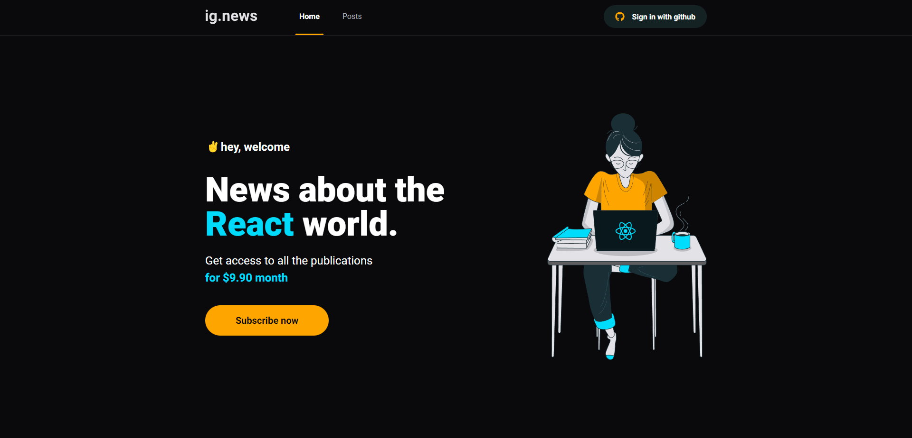
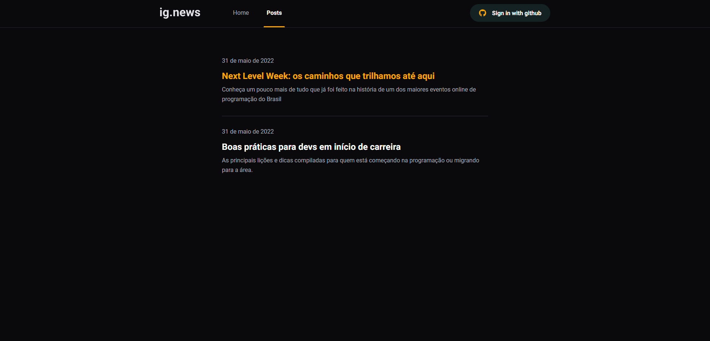

<div align="center">
  <h2>Ignews | Rocketseat Ignite</h2>

</div>

<p align="center" style="margin-top: 35px">
  
    
</p>


## Sobre o Projeto
Ignews é uma das etapas do curso [Rocketseat | Ignite ReactJs](https://www.rocketseat.com.br/) onde exploramos recursos serverless do [NextJs](https://nextjs.org/). O blog possui integração com Stripe, o exercício é liberar o conteúdo após a inscrição do usuário, caso contrário, ele verá apenas uma parte do post.

### 🛠 Tecnologias
As seguintes ferramentas foram usadas na construção do projeto:

- [Next.js](https://nextjs.org/)
- [Prismic CMS](https://prismic.io/)
- [Stripe](https://stripe.com/)
- [FaunaDB](https://fauna.com/)


### 🎲 Rodando o projeto

```bash
# Instale as dependências
$ yarn install
# ou
$ npm install

# Execute a aplicação
$ yarn dev
# ou
$ npm run dev
```